previews

one section per phone, every style that builds, seen from the back | python case.py writes them

se-2-3

| base | case | slot | magsafe | sides | corners | frame | backless | plateframe | plate | spine | slider | cig | corner | ribs | ribcorner |
|---|---|---|---|---|---|---|---|---|---|---|---|---|---|---|---|
| 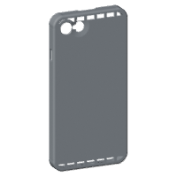 | 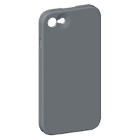 | 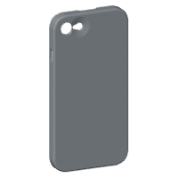 |  | 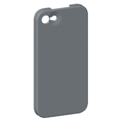 | 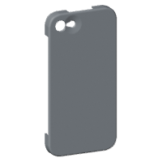 | 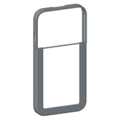 | 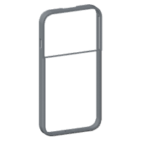 | 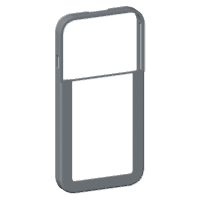 | 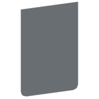 | 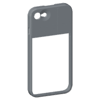 | 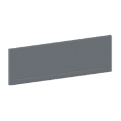 | 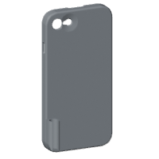 |  | 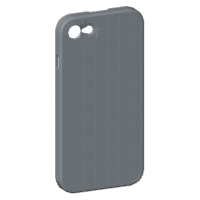 | 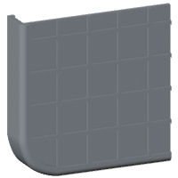 |

12-mini

| base | case | slot | magsafe | sides | corners | frame | backless | plateframe | plate | corner | ribs | ribcorner |
|---|---|---|---|---|---|---|---|---|---|---|---|---|
| 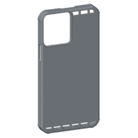 | 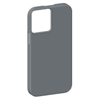 |  |  | 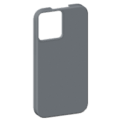 | 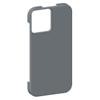 | 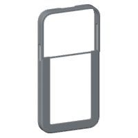 | 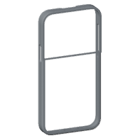 | 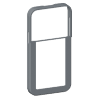 |  |  |  | 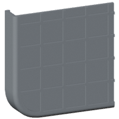 |

12

| base | case | slot | magsafe | sides | corners | frame | backless | plateframe | plate | spine | slider | cig | corner | ribs | ribcorner |
|---|---|---|---|---|---|---|---|---|---|---|---|---|---|---|---|
| 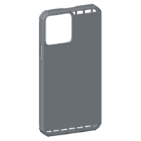 |  |  | 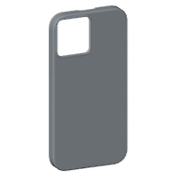 |  | 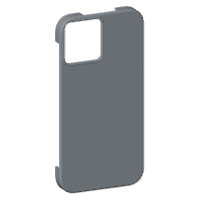 | 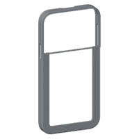 | 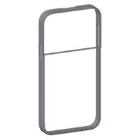 | 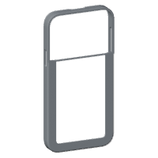 |  | 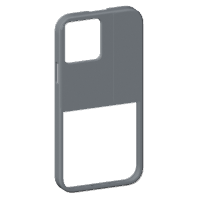 | 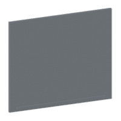 | 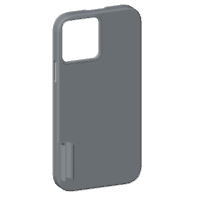 |  |  | 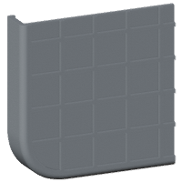 |

12-pro

| base | case | slot | magsafe | sides | corners | frame | backless | plateframe | plate | cig | corner | ribs | ribcorner |
|---|---|---|---|---|---|---|---|---|---|---|---|---|---|
|  | 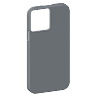 | 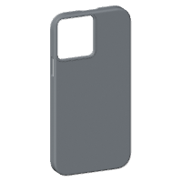 | 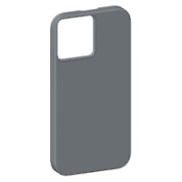 |  | 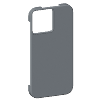 |  | 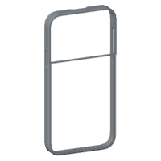 | 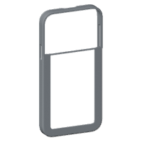 | 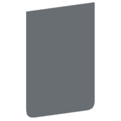 | 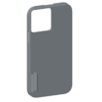 |  |  |  |

12-pro-max

| base | case | slot | magsafe | sides | corners | frame | backless | plateframe | plate | cig | corner | ribs | ribcorner |
|---|---|---|---|---|---|---|---|---|---|---|---|---|---|
| 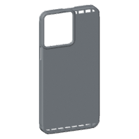 | 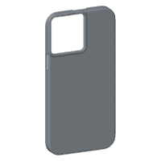 |  |  |  | 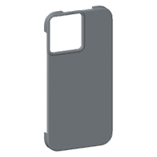 | 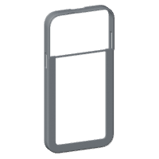 | 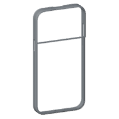 | 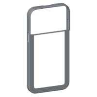 |  | 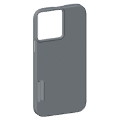 |  |  |  |

13-mini

| base | case | slot | magsafe | sides | corners | frame | backless | plateframe | plate | corner | ribs | ribcorner |
|---|---|---|---|---|---|---|---|---|---|---|---|---|
|  |  | 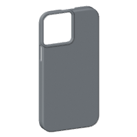 |  | 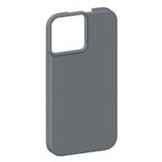 | 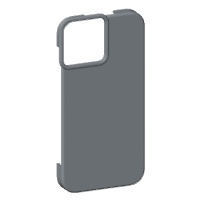 |  |  |  |  |  |  |  |

13

| base | case | slot | magsafe | sides | corners | frame | backless | plateframe | plate | cig | corner | ribs | ribcorner |
|---|---|---|---|---|---|---|---|---|---|---|---|---|---|
|  |  |  |  |  |  |  |  |  |  |  |  |  |  |

13-pro

| base | case | slot | magsafe | sides | corners | frame | backless | plateframe | plate | cig | corner | ribs | ribcorner |
|---|---|---|---|---|---|---|---|---|---|---|---|---|---|
|  |  |  |  |  |  |  |  |  |  |  |  |  |  |

13-pro-max

| base | case | slot | magsafe | sides | corners | frame | backless | plateframe | plate | cig | corner | ribs | ribcorner |
|---|---|---|---|---|---|---|---|---|---|---|---|---|---|
|  |  |  |  |  |  |  |  |  |  |  |  |  |  |

14

| base | case | slot | magsafe | sides | corners | frame | backless | plateframe | plate | cig | corner | ribs | ribcorner |
|---|---|---|---|---|---|---|---|---|---|---|---|---|---|
|  |  |  |  |  |  |  |  |  |  |  |  |  |  |

14-plus

| base | case | slot | magsafe | sides | corners | frame | backless | plateframe | plate | cig | corner | ribs | ribcorner |
|---|---|---|---|---|---|---|---|---|---|---|---|---|---|
|  |  |  |  |  |  |  |  |  |  |  |  |  |  |

14-pro

| base | case | slot | magsafe | sides | corners | frame | backless | plateframe | plate | cig | corner | ribs | ribcorner |
|---|---|---|---|---|---|---|---|---|---|---|---|---|---|
|  |  |  |  |  |  |  |  |  |  |  |  |  |  |

14-pro-max

| base | case | slot | magsafe | sides | corners | frame | backless | plateframe | plate | cig | corner | ribs | ribcorner |
|---|---|---|---|---|---|---|---|---|---|---|---|---|---|
|  |  |  |  |  |  |  |  |  |  |  |  |  |  |

15

| base | case | slot | magsafe | sides | corners | frame | backless | plateframe | plate | cig | corner | ribs | ribcorner |
|---|---|---|---|---|---|---|---|---|---|---|---|---|---|
|  |  |  |  |  |  |  |  |  |  |  |  |  |  |

15-plus

| base | case | slot | magsafe | sides | corners | frame | backless | plateframe | plate | cig | corner | ribs | ribcorner |
|---|---|---|---|---|---|---|---|---|---|---|---|---|---|
|  |  |  |  |  |  |  |  |  |  |  |  |  |  |

15-pro

| base | case | slot | magsafe | sides | corners | frame | backless | plateframe | plate | cig | corner | ribs | ribcorner |
|---|---|---|---|---|---|---|---|---|---|---|---|---|---|
|  |  |  |  |  |  |  |  |  |  |  |  |  |  |

15-pro-max

| base | case | slot | magsafe | sides | corners | frame | backless | plateframe | plate | cig | corner | ribs | ribcorner |
|---|---|---|---|---|---|---|---|---|---|---|---|---|---|
|  |  |  |  |  |  |  |  |  |  |  |  |  |  |

16

| base | case | slot | magsafe | sides | corners | frame | backless | plateframe | plate | cig | corner | ribs | ribcorner |
|---|---|---|---|---|---|---|---|---|---|---|---|---|---|
|  |  |  |  |  |  |  |  |  |  |  |  |  |  |

16-plus

| base | case | slot | magsafe | sides | corners | frame | backless | plateframe | plate | cig | corner | ribs | ribcorner |
|---|---|---|---|---|---|---|---|---|---|---|---|---|---|
|  |  |  |  |  |  |  |  |  |  |  |  |  |  |

16e

| base | case | slot | magsafe | sides | corners | frame | backless | plateframe | plate | spine | slider | cig | corner | ribs | ribcorner |
|---|---|---|---|---|---|---|---|---|---|---|---|---|---|---|---|
|  |  |  |  |  |  |  |  |  |  |  |  |  |  |  |  |

16-pro

| base | case | slot | magsafe | sides | corners | frame | backless | plateframe | plate | cig | corner | ribs | ribcorner |
|---|---|---|---|---|---|---|---|---|---|---|---|---|---|
|  |  |  |  |  |  |  |  |  |  |  |  |  |  |

16-pro-max

| base | case | slot | magsafe | sides | corners | frame | backless | plateframe | plate | cig | corner | ribs | ribcorner |
|---|---|---|---|---|---|---|---|---|---|---|---|---|---|
|  |  |  |  |  |  |  |  |  |  |  |  |  |  |

17

| base | case | slot | magsafe | sides | corners | frame | backless | plateframe | plate | cig | corner | ribs | ribcorner |
|---|---|---|---|---|---|---|---|---|---|---|---|---|---|
|  |  |  |  |  |  |  |  |  |  |  |  |  |  |

17e

| base | case | slot | magsafe | sides | corners | frame | backless | plateframe | plate | spine | slider | cig | corner | ribs | ribcorner |
|---|---|---|---|---|---|---|---|---|---|---|---|---|---|---|---|
|  |  |  |  |  |  |  |  |  |  |  |  |  |  |  |  |

air

| base | frame | backless | plateframe | plate |
|---|---|---|---|---|
|  |  |  |  |  |

17-pro

| base | frame | backless | plateframe | plate |
|---|---|---|---|---|
|  |  |  |  |  |

17-pro-max

| base | frame | backless | plateframe | plate |
|---|---|---|---|---|
|  |  |  |  |  |

18-pro

| base | frame | backless | plateframe | plate |
|---|---|---|---|---|
|  |  |  |  |  |

18-pro-max

| base | frame | backless | plateframe | plate |
|---|---|---|---|---|
|  |  |  |  |  |
